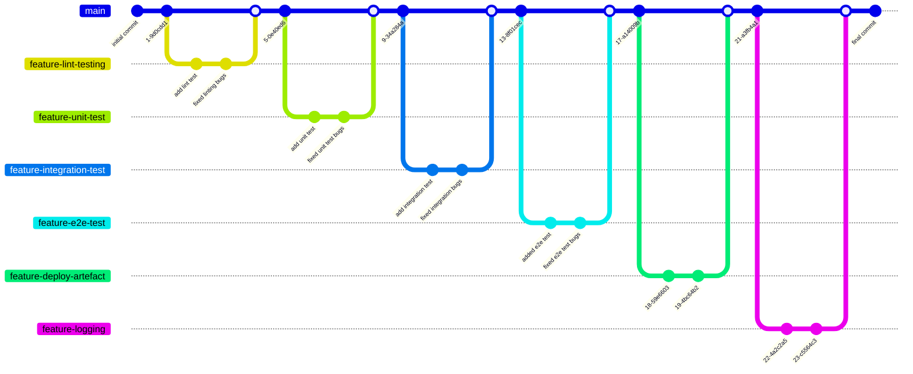
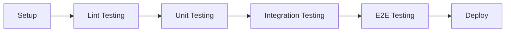

# COSC2759 Assignment 1

## Notes App - CI Pipeline

- Full Name: **Luke Macdonald**
- Student ID: **s3888490**

## 1. Analysis of Problem

Alpine Inc has recently developed a web application designed for users to create simple Notes. The application was built
using NodeJs, Express and MongoDB.

The source code for is application is solely built and deployed manually from the lead developer's laptop. Pete has
taken a recent leave of absence from work which has created multiple issues for the team:

- a new feature designed for one of the company's largest clients was not released.
- Increase in the number of customer support calls caused by the introduction of bugs into production.
- The team's morale has been reduced as they have had to work overtime to manage this issue.
- Alpine Inc.'s revenue has been impacted.

A strategy has been proposed by Alpine Inc to automate the build and testing processes of the application so that they
can effectively:

- reduce dependency on the Lead Developer
- Pick up bugs and defects as soon as possible before they can be pushed into production.
- reduce the strain on the teams and increase morale.
- improve the reliability of releases.

## 2. Explain and justify the solution

### 2.1 GitHub Flow of Solution (Order of Branch/Feature Creation)

When developing my pipeline, I decided to split each test into its own jobs and then decided that I could create a new
feature branch for each of these jobs.

The flow of the jobs went in order of dependence.

- For example, if linting were to fail, then it is most likely that unit tests would fail. Therefore, I created the job
  for linting before creating the job for unit tests.
- To save time on execution if one of the jobs were to fail, the pipeline jobs will run in serial rather than parallel
  because if all jobs were to run in parallel if unit tests were to fail then it is most likely that e2e tests will also
  fail, but we would still have to wait for the e2e testing to finishing executing become the workflow would exit.
    - Therefore, time is now saved because if the unit test fails then the workflow will immediately exit and the e2e testing 
      won’t even begin running.

### 2.2 Flow of CI Pipeline Workflow Jobs

1. **Setup**
    - The first step in the workflow is the setup job. This is where the workflow will check its cache and see if the
      dependencies have already been cached, if so then the dependencies cache is used to restore the dependencies, if not then
      the dependencies are installed and then cached.
2. **Lint Testing**
    - The first set after the initial setup job is lint testing. Lint testing is run first because its operations are the
      ones least dependent and influenced by other jobs. I.e. there are no other jobs that if they failed then that
      means that linting would also fail.
    - Linting is the process of checking the code for syntax errors, style violations, and other common programming mistakes. 
    - A condition is placed on the job so that if ***npm run test-lint*** fails then they workflow will be stopped and a
      file that includes all the output from the lint testing will be uploaded as an artifact for the developer to view
      and understand why the test failed.
        - File is only uploaded if the test fails, if it succeeds then no file is uploaded.
3. **Unit Testing**
    - The next job after lint testing is unit testing. Unit testing is a type of testing that focuses on testing individual units 
      or components of the code in isolation. 
    - Unit testing is performed after linting because it helps to ensure that the code is correct and consistent before testing it.
      unit testing to fail, and unit testing is run before integration and E2E testing because if unit testing was to
      fail then both of those tests are likely to fail as well, therefore it saves on time to run unit testing first.
    - 
    - When running the unit test a code coverage report is generated by jest and at the end of the job that code
      coverage report is uploaded as an artifact.
    - Similar to lint testing if the job fails then a log of the unit tests will be uploaded as an artifact for the
      developer to use to determine what went wrong and what actions can be taken to repair the mistakes.
4. **Integration Testing**
    - The next job after unit testing is integration testing. Integration testing is a type of testing that checks if 
      the different components of the code work together correctly. It's often done after unit testing because while 
      unit testing tests the individual components, integration testing tests how these components work together. 
      Therefore, if a unit test were to fail then the integration test would fail aswell.
    - Exactly like with unit testing when running the integration test a code coverage report is generated by jest and
      at the end of the job that code coverage report is uploaded as an artifact.
    - Also, exactly like unit testing and lint testing if the job fails then a log of the unit tests will be uploaded as
      an artifact for the developer to use to determine what went wrong and what actions can be taken to repair the
      mistakes.
5. **End to End (E2E) Testing**
    - The final testing job to be run is e2e testing. This is because this test is the one most likely to be impacted by
      all the others (i.e. if one of those tests failed its most likely this one would fail) therefore making it more
      time cost-effective to place this test last.
    - End-to-End testing is a type of testing that checks the entire system or application to ensure that it works as expected 
      from start to finish. It involves testing the user interface, the back-end code, and all the components in between.
    - Similar to all other tests if this test were to fail when running this would produce a log file for the developer
      to download which can help them understand what went wrong with the code.
6. **Deployment (if on main branch)**
    - This is the final job of the workflow and this job will only run when a change is made to the main branch as
      compared to all the other jobs which run on all branches.
    - In this job is run last after all the testing because it involves packaging up the application using the *
      ***********npm pack************ command and then that will be uploaded as an artefact that can be used for
      deployment.
    - It is important that the deployment job only runs if all other jobs correctly run and ensure so bugs are in the
      application.

### 2.2 Justifying Choices Made in Pipeline

1. Cache Dependencies
    - As each job is run on a different system this would usually require each job to have to install the dependencies of
      the application. This however can cause the execution of each job to grow significantly. Therefore, in order to
      manage the pipelines workflow time for effectively a setup job has been included in the pipeline which installs
      the dependencies needed in the application and caches those dependencies which can then be accessed by the other
      jobs without them having to install them.
        - The process of installing and caching dependencies only has to occur once (or for the first workflow after a
          dependency change occurred) this means that even the setup job won’t always have to install the dependencies
          and instead can check if a cache exists instead and restore dependencies based on that cache.
2. Code Coverage Percentage
    - After some research it was found that 80% or higher code coverage is generally aim for, therefore for global
      thresholds for code coverage was set to 80%.
3. Changes made to configuration files
    - When running the e2e testing there was an error in the tests. After some investigation it was found that one of
      the browser hosts “webkit” AKA Desktop Safari was causing the error as it was not compatible with the latest
      version of ubuntu used to run the workflow. Therefore, this host was removed as one of the testing browsers from
      the playwright configuration file.
    - Inside the ***jest.config.js*** code was added to allow for a log file which exported all the output from the jest
      testing into a file which could be accessed by GitHub Actions to upload in case of a failure so that the developer
      could determine what went wrong.
## Failure Scenarios